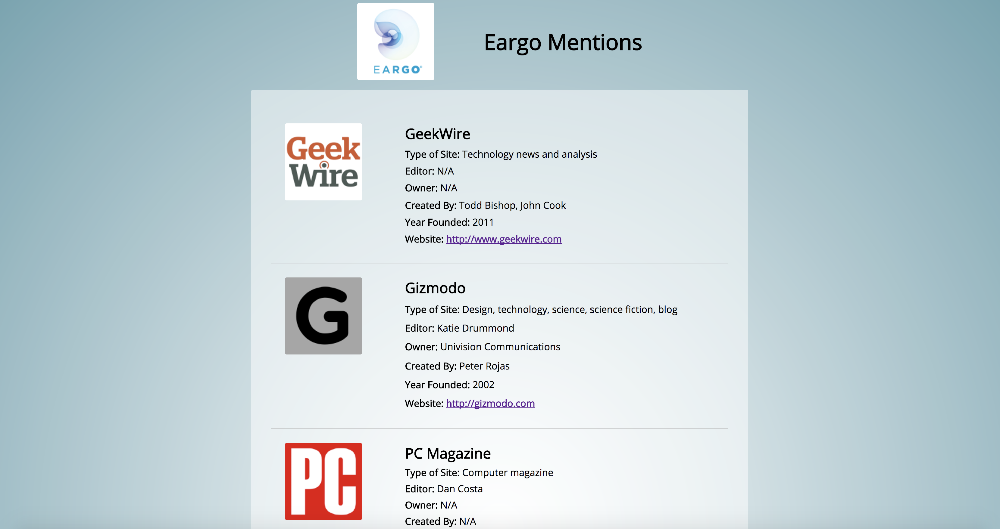

# Eargo Mentions

## To Run Locally

* Install all libraries using `npm install`

* Also be sure to install all Gemfiles with `bundle install`

* Make sure to run webpack (`npm run webpack` or `webpack -w` if making changes)

* Run `rails s` to start up the server

* Navigate to `localhost:3000`

## Background

The purpose of this website is to list the publications that Eargo has been featured in. All information is fetched from the Wikipedia API, parsed on the backend, and passed to the front end to be rendered.  The logo is fetched using the Clearbit Logo API, as Wikipedia does not provide the full url to their images.  Each publication's data is based on the information that is in it's infobox on it's wikipedia page.  The infobox is the small gray box that contains facts about the subject.  The infobox is not consistent for every publication, so a field with an "N/A" means that Wikipedia did not provide the information.

This project is done with Ruby on Rails on the backend and ReactJS with Redux (a JavaScript framework) on the frontend.



## Usage

Users can find information about each publication.  Users can click anywhere on the publication item to navigate to that publication's website.  

## Backend

In order to access the information in the infobox of a wikipedia page, a very specific API call must be made.  The data does not come back cleanly, nor does it come back the same for every page, and must be parsed.  An example response looks like this:

```javascript
{
    "batchcomplete": "",
    "query": {
        "normalized": [
            {
                "from": "gizmodo",
                "to": "Gizmodo"
            }
        ],
        "pages": {
            "9089855": {
                "pageid": 9089855,
                "ns": 0,
                "title": "Gizmodo",
                "revisions": [
                    {
                        "contentformat": "text/x-wiki",
                        "contentmodel": "wikitext",
                        "*": "{{Distinguish2|[[Gizmondo]], the handheld game console}}\n{{Infobox Website\n| name = Gizmodo\n| logo = File:Gizmodo.svg\n| screenshot = File:Gizmodoscreenshot.png\n| caption = \n| url = {{URL|http://gizmodo.com}}\n| commercial = Yes\n| type = [[Design]], [[technology]], [[science]], [[science fiction]], [[blog]]\n| country of origin = United States\n| language = English, French, Dutch, Italian, German, Spanish, Japanese, Polish, Portuguese\n| registration = Optional\n| owner = [[Univision Communications]]\n| author = [[Peter Rojas]]\n| editor = Katie Drummond\n| launch date = {{start date and age|2002|7|1}}<ref>{{cite web|url=http://whois.domaintools.com/gizmodo.com|title=Gizmodo.com WHOIS, DNS, & Domain Info - DomainTools|work=[[WHOIS]]|date= |accessdate=2016-09-16}}</ref>\n| current status = Active\n| revenue =\n| slogan =\n| alexa = {{decrease}} [http://www.alexa.com/siteinfo/gizmodo.com 548] {{small|{{nowrap|(Global, {{as of|2016|12|28|alt=December 2016}})}}}}\n}}\n\n'''Gizmodo''' ({{IPAc-en|\u0261|\u026a|z|\u02c8|m|o\u028a|d|o\u028a}} {{respell|giz|MOH|doh}}) is a design, technology, science and science fiction website that also writes articles on politics. It was originally launched as part of the [[Gawker Media]] network run by [[Nick Denton]], and runs on the [[Kinja]] platform. Gizmodo also includes the subsite [[io9]], which focuses on science fiction and futurism as they relate to politics."
                    }
                ]
            }
        }
    }
}
```

Using string manipulation, the backend parses this data and passes an object to the front end, which can be easily read and rendered.  

## Frontend

ReactJS with Redux is used on the frontend.  Once the main component mounts, it tells the backend to make the request to the API via jQuery and AJAX. Once the data has been parsed and passed to the frontend, it is stored in the Redux store.  Based on the above response, the object passed would look like this:

```javaScript
{
  "title": "Gizmodo",
  "editor": "Katie Drummond",
  "owner": "Univision Communications",
  "publisher": "N/A",
  "type": "Design, technology, science, science fiction, blog",
  "creator": "Peter Rojas",
  "url": "http://gizmodo.com",
  "year": "2002",
}
```

Notes about this response:
 - If there is no owner, the publisher is rendered instead.
 - In this case, the Wikipedia API did not have the publication information.  
 - If there was no "http://" in front of the website url, it was added.

Once the store is updated, the component re-renders, and displays the information.

## Future Plans

Improvements to this project can include:

- Listing the actual articles Eargo is mentioned in on each site
- Improvements to parsing, such as less string manipulation or changing the API
- Adding more pages 
- Improvements to styling
